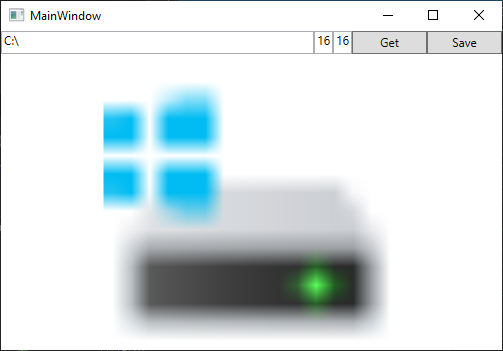
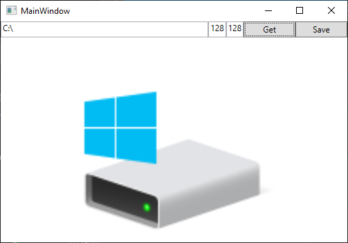
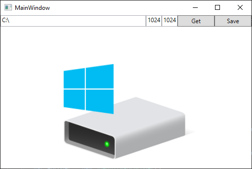
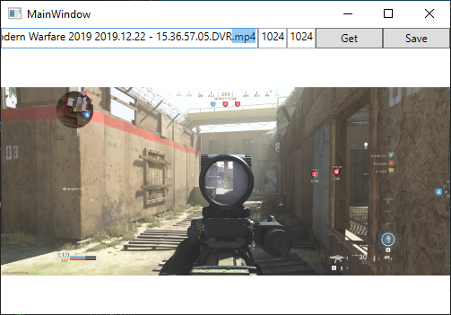

# GetIconCSharp
Sample code to get file icons from Windows. Actually uses the Windows API and works with icons up to 1024, and will return the correct icon for the resolution. 16x16 will return a different icon than 32x32.

Also works for getting a thumb of video files.

  
  
  
